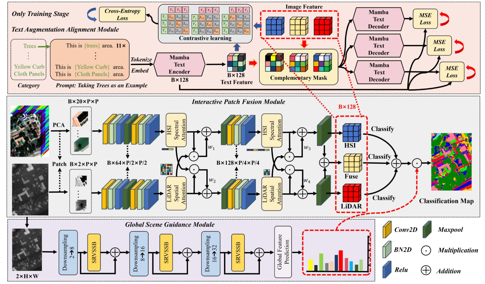

# TAPSCN: Text-Augmented Patch-Scene Collaborative Network for Multi-Source Remote Sensing Data Classification

This repository provides the PyTorch implementation of **TAPSCN**, a text-augmented patch-scene collaborative network for joint hyperspectral image (HSI) and LiDAR data classification.

TAPSCN combines local patch-level multimodal representation learning, global scene guidance, and text-based semantic alignment. The text augmentation branch is used during training and does not introduce additional text input during inference.

## Network Architecture



The framework contains three main components:

- **Interactive Patch Fusion Module (IPFM):** extracts HSI spectral features and LiDAR spatial features through two interactive stages, producing HSI, LiDAR, and fused predictions.
- **Global Scene Guidance Module (GSGM):** models the full-scene LiDAR information and generates global category guidance for patch-level classification.
- **Text Augmentation Alignment Module (TAAM):** encodes category prompts, aligns visual and textual representations through contrastive learning, and reconstructs text features with complementary masking.

## Requirements

Python 3.10 or later is recommended. The main dependencies include:

- PyTorch
- NumPy
- SciPy
- scikit-learn
- scikit-image
- Matplotlib
- pandas
- OpenCV
- [OpenAI CLIP](https://github.com/openai/CLIP)
- einops
- timm
- fvcore

A basic environment can be created as follows:

```bash
conda create -n tapscn python=3.10 -y
conda activate tapscn

pip install torch torchvision
pip install numpy scipy scikit-learn scikit-image matplotlib pandas opencv-python
pip install einops timm fvcore
pip install git+https://github.com/openai/CLIP.git
```

### Mamba and VMamba

The Mamba-based implementation requires a correctly configured [Mamba](https://github.com/state-spaces/mamba) and [VMamba](https://github.com/MzeroMiko/VMamba) environment, including the CUDA operators used by the selective scan modules. Follow their official installation instructions and ensure that their versions are compatible with your PyTorch and CUDA versions.

If Mamba is unavailable, the Mamba encoder/decoder can be replaced with a Transformer encoder/decoder while preserving the same input and output dimensions. The current text encoder and decoder in `model/model.py` include a Transformer implementation, and the retained Mamba reference code can be enabled after the Mamba environment is configured. Mamba-based global blocks can likewise be replaced by Transformer or attention blocks with matching tensor shapes.

## Datasets

The datasets used in the experiments can be downloaded from the following links:

| Dataset | Download link | Extraction code |
| --- | --- | --- |
| Trento | [Baidu Netdisk](https://pan.baidu.com/s/13GngaSzVIapHDe1loM2oLA) | `6e45` |
| MUUFL | [Baidu Netdisk](https://pan.baidu.com/s/1anhkQQWoUCbsn3ypkMD_vQ) | `4qqk` |
| Houston 2018 | [Baidu Netdisk](https://pan.baidu.com/s/1ENogDo9F3w3BJizcFpUGxQ) | `rezy` |
| Houston 2013 | [Baidu Netdisk](https://pan.baidu.com/s/1SEARpsjNeMo4iJUyjxZ0zw) | `sbje` |
| Berlin | [Baidu Netdisk](https://pan.baidu.com/s/1ff0RF5o0LHrW8Vu2UO4qoA) | `7w9x` |
| Augsburg | [Baidu Netdisk](https://pan.baidu.com/s/1o-47kBK3VAlxeqZ8ALNMCQ) | `bfwv` |

After downloading, organize the data in a directory such as:

```text
dataset/
├── MUUFL/
├── Trento/
├── Houston2013_Data/
├── Houston2018/
├── Berlin/
└── Augsburg/
```

Set `data_path1` in `utils/dataprocess.py` to the absolute path of your dataset directory. The current demo contains dataset entries for `Muufl`, `Trento`, `Houston`, `Houston18`, and `Augsburg`. To use Berlin or a dataset with different file names, add the corresponding loading rule in `load_data()`.

## Project Structure

```text
TAPSCN/
├── assets/
│   └── TAPSCN_framework.png
├── model/
│   ├── model.py
│   ├── Vmama2.py
│   └── mamba2/
├── utils/
│   ├── dataprocess.py
│   ├── evulate.py
│   ├── generatepic.py
│   └── output.py
└── demo.py
```

## Usage

Run an experiment through `demo.py`. The dataset name and number of classes must be consistent:

```bash
# Houston 2013
python demo.py --dataset Houston --num_classes 15 --batch_size 16

# Trento
python demo.py --dataset Trento --num_classes 6

# MUUFL
python demo.py --dataset Muufl --num_classes 11

# Houston 2018
python demo.py --dataset Houston18 --num_classes 20

# Augsburg
python demo.py --dataset Augsburg --num_classes 7
```

Frequently used options include:

```text
--seed             Random seed
--epoches          Number of training epochs
--learning_rate    Initial learning rate
--batch_size       Training batch size
--patches1         Spatial patch size
--proto_refresh    Text prototype refresh interval
--lambda_re        Text reconstruction loss weight
--lambda_c         Contrastive loss weight
```

The best checkpoint and evaluation outputs are saved under the directory named after the selected dataset.

## Citation

If this code is useful for your research, please cite our work. The publication information will be updated after the paper is formally published.

```bibtex
@article{xie2026tapscn,
  title   = {Text-Augmented Patch-Scene Collaborative Network for Multi-Source Remote Sensing Data Classification},
  author  = {Xie, Zhenyang and others},
  year    = {2026}
}
```

## Contact

If you have any questions, please contact:

Zhenyang Xie: xiewak@163.com
